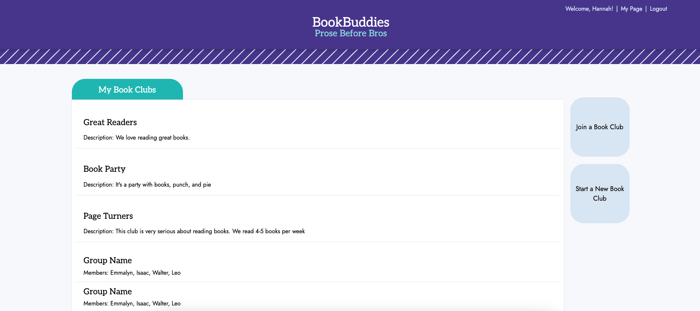
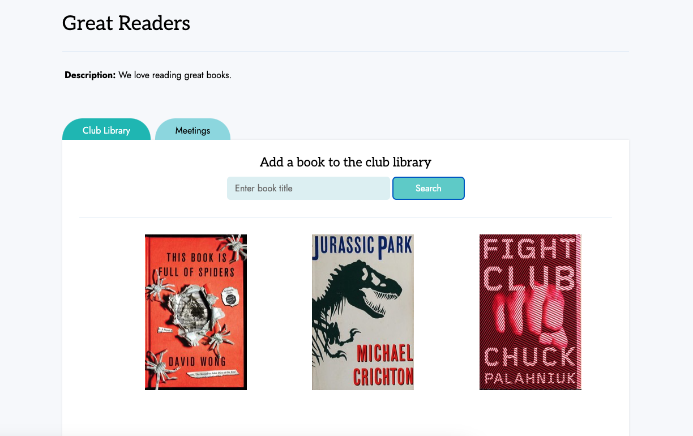

# Book Buddies 	  

## Table Of Contents
- [Description](#description)
- [Installation](#installation)
- [Usage](#usage)
- [Contributing](#contributing)
- [License](#license)
- [Tests](#tests)
- [Questions](#questions)

# Description
Book Buddies is a book club application for users to be able to create their own book clubs, access existing book clubs, schedule book club meetings, and add books to the book club library. Users are able to interact with other book club members from anywhere.

# Usage
Navigate to https://group-8-project.onrender.com/ and create a user. Once created, you'll have access to all of the features on Book Buddies! To join a book club, simply click the 'Join A Bookclub' button and  enter the relevant information.  To create a book club click the 'Start a new bookclub' button and fill out the relevant information.  To view the clubs you are in click on the names listed under 'My Book Clubs'. Once in a book club you can add new books by searching for them and adding them to the library.

# Contributing
Hannah Schwen, Stephan Kwapis, Cesar Castro, Selena Pixton, Adam Orf

# Visuals/Links

https://group-8-project.onrender.com/ 

# License
MIT

# Tests
Testing was completed using Insomnia and console logs.

# Questions
Adam’s github - https://github.com/stump297/  
Hannah’s github: https://github.com/hannahschwen  
Selena’s github: https://github.com/selenapix  
Stephan’s github: https://github.com/sdkwapis  
Cesar’s github: https://github.com/cj4871